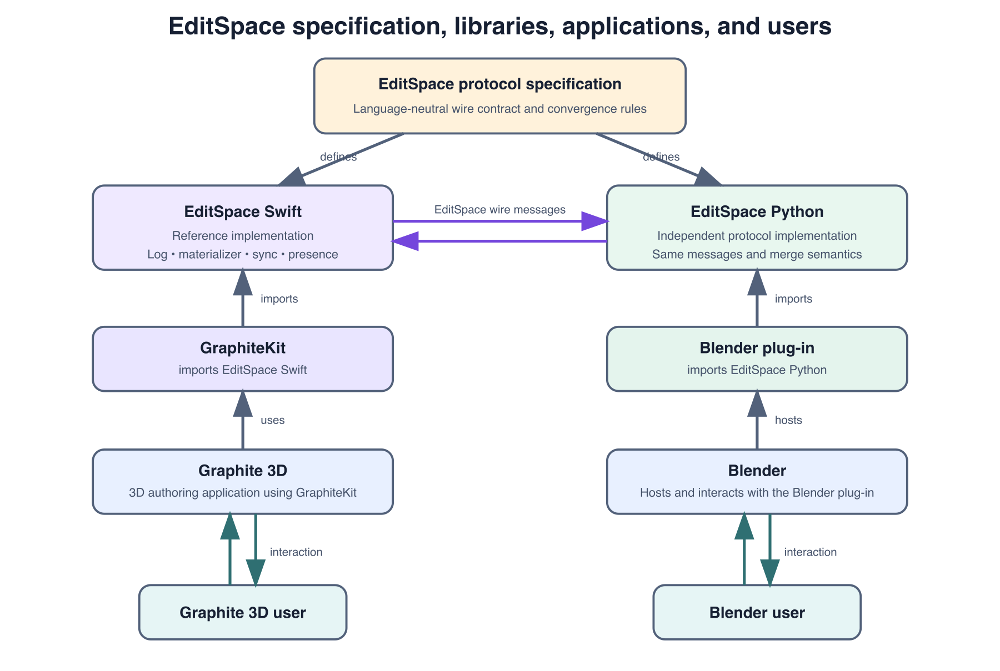
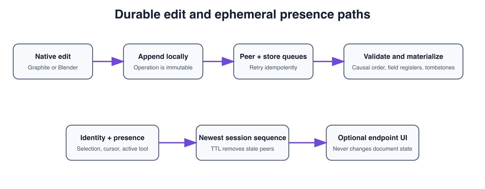

# Purpose

EditSpace is a language-neutral collaboration protocol for structured 3D editing. The specification is the source of truth. This repository contains the Swift reference implementation. A separate Python library will implement the same specification, and the Blender plug-in will import that Python library.

The design separates durable edits from ephemeral human presence. An endpoint can render other collaborators, their selections, cursors, rays, cameras, or active tools without placing that transient state in the document history.



# Design rules

1. Operations are truth and snapshots are caches.
2. Every accepted operation is immutable and globally identified.
3. App and renderer types never cross the protocol boundary.
4. Causal order is honored; concurrent ties use `(sequence, actor ID, operation ID)`.
5. Fields merge independently as last-writer-wins registers.
6. Deletion is represented by a tombstone.
7. Unknown future operations are preserved and reported as compatibility data.
8. Identity and presence are first-class protocol messages but never durable document edits.

# Components

The specification defines the common wire contract and convergence rules. The Swift and Python libraries descend independently from that specification and exchange the same messages. GraphiteKit imports EditSpace Swift, and Graphite 3D uses GraphiteKit as its modelling and collaboration library. The Blender plug-in imports EditSpace Python and is hosted by Blender. Graphite 3D users and Blender users interact with their respective applications rather than with the protocol libraries directly. Within either language library, the endpoint adapter converts native actions and values into EditSpace operations. `OperationLog` validates, deduplicates, and preserves them. `Materializer` deterministically reduces the log into `DocumentState`. `SyncEngine` manages peer and durable-store queues while leaving networking and storage to adapter protocols.



# Wire protocol

Version 1 messages are UTF-8 JSON. The durable envelope kind is `editspace.operations`; the ephemeral kind is `editspace.presence`. Dates use RFC 3339/ISO 8601 UTC strings. Values use only the JSON value domain.

## Durable operation

An operation includes schema version, document ID, immutable operation ID, actor ID, actor-local sequence, causal dependencies, action, entity kind, target/source IDs, JSON field writes and arguments, required feature tokens, and optional producer diagnostics.

Core actions are create, update, delete, duplicate, link, and unlink. Core entity kinds cover documents, objects, modifiers, materials, assets, constraints, parameters, dependencies, and legacy snapshots. All are encoded as open string tokens so independently developed implementations can preserve extensions.

Exact duplicates are ignored. Reusing an ID with different content is a collision. An unsupported operation is preserved without changing materialized state.

## Identity and presence

`PeerIdentity` contains a stable peer ID, the actor ID that connects presentation to authored operations, optional display name/color/avatar, and extensible attributes. `PeerPresence` adds a connection-scoped session, monotonic sequence, state, selections, generic focus metadata, timestamp, and TTL.

Receivers retain the greatest sequence per session and remove expired or offline sessions. Presence grants no permissions. All presentation fields are untrusted, and every endpoint decides what to display.

# Swift API

## IDs and values

- `DocumentID`, `ActorID`, `EntityID`, `OperationID`, `SessionID`: strongly typed string IDs.
- `ProtocolToken`: extensible string representation used by `OperationAction`, `EntityKind`, and `Feature`.
- `EntityReference`: entity kind plus stable ID.
- `OperationStamp`: deterministic `(sequence, actorID, operationID)` ordering tuple.
- `Value`: Codable JSON null, bool, number, string, array, or object.

## Operations and codecs

- `EditOperation`: immutable durable edit.
- `Producer`: optional app/library provenance used for diagnostics.
- `OperationEnvelope`: `editspace.operations` batch.
- `OperationCodec`: sorted-key JSON encoding and validated decoding.
- `CodecError`: wrong kind, newer envelope schema, or document mismatch.

## Compatibility and reduction

- `CompatibilityPolicy`: supported schema, actions, entity kinds, and features.
- `CompatibilityProblem`: structured non-destructive incompatibility.
- `OperationLog`: idempotent append-only accepted and rejected operation sets.
- `FieldRegister`, `EntityState`, `DocumentState`: materialized CRDT data.
- `Materializer`: deterministic log reduction.

## Synchronization

- `SyncEngine`: imports operations and routes accepted IDs to peer/store queues.
- `SyncResult`: accepted, duplicate, and rejected operation IDs.
- `OperationTransport`: async byte transport adapter interface.
- `OperationStore`: async append/fetch durable-store adapter interface.

## Collaboration presence

- `PeerIdentity`: stable presentation-to-author link.
- `PeerPresence`: expiring session state.
- `PresenceEnvelope` and `PresenceCodec`: wire representation.
- `PresenceRoster`: newest-record and TTL handling.

# Typical Swift flow

```swift
let documentID = DocumentID(rawValue: "scene")
let operation = EditOperation(
    documentID: documentID,
    actorID: ActorID(rawValue: "ada"),
    sequence: 1,
    action: .create,
    entity: .object,
    targetID: EntityID(rawValue: "cube"),
    fields: ["name": .string("Cube")]
)

var engine = SyncEngine(documentID: documentID)
engine.append([operation], source: .local)
let state = engine.state
```

# Blender/Python implementation checklist

Implement the JSON Schemas first and validate against shared golden fixtures. Persist EditSpace entity IDs in Blender custom properties rather than object names. Keep the operation log separate from Blender's evaluated dependency graph. Apply remote scene changes on Blender's main thread. Treat presence as disposable UI state. Compare decoded semantic operation content when detecting duplicates, and never use local wall-clock time for merge order.

# Security and limits

Authentication and encryption belong to the transport. Implementations should bind authenticated connections to actor/peer identity, sanitize user-facing strings and URLs, cap message size, nesting, operation count, dependency count and metadata sizes, and reject non-finite numbers. Presence is advisory and never conveys authorization.

# Versioning

Optional members may be added compatibly. Required new semantics use feature tokens. Incompatible representation changes increment the appropriate schema version. Extension tokens should use a collision-resistant namespace.

# Further reference

The repository README contains complete examples and field tables. `Docs/Protocol.md` is the normative v1 specification, and `Schemas/` contains language-neutral JSON Schemas. The Xcode project generates symbol-level documentation from the public Swift doc comments and DocC catalog.
